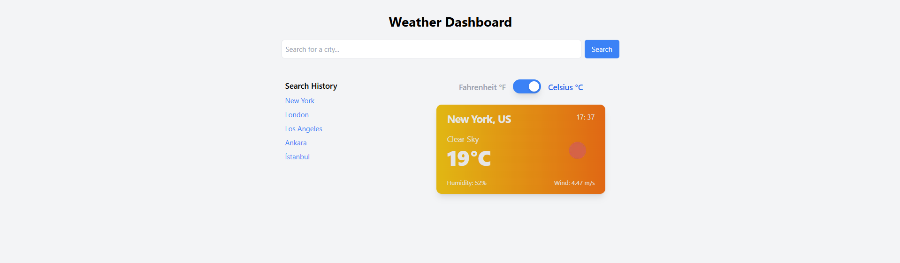
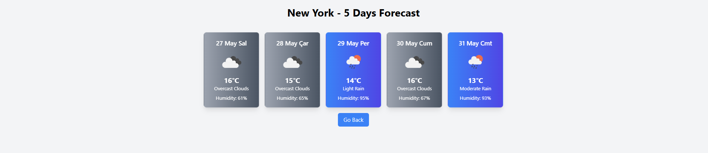

# Weather Dashboard

A simple and responsive weather dashboard built with Next.js, TypeScript, and React Query. It allows users to search for current weather conditions and a 5-day forecast for any city, with the option to toggle between Celsius and Fahrenheit units.

## Features

- **Current Weather**: Displays the current weather conditions for a searched city, including temperature, humidity, wind speed, and a dynamic background gradient based on the weather.
- **5-Day Forecast**: Shows a 5-day weather forecast with daily summaries.
- **Unit Toggle**: Switch between Celsius (metric) and Fahrenheit (imperial) units.
- **Search History**: Stores the last 5 searched cities for quick access.
- **Responsive Design**: Works seamlessly on both desktop and mobile devices.
- **Error Handling**: Gracefully handles invalid city searches and API errors.

## Tech Stack

- **Next.js**: For building the React application with server-side rendering.
- **TypeScript**: For type safety and better developer experience.
- **React Query**: For efficient data fetching and caching.
- **Tailwind CSS**: For styling the UI.
- **OpenWeatherMap API**: For fetching weather data.
- **React Router DOM**: For client-side routing.

## Prerequisites

Before you begin, ensure you have the following installed:

- **Node.js** (v14 or higher)
- **npm** (or yarn)
- **Git**

## Setup Instructions

Follow these steps to set up and run the project locally:

1. **Clone the repository**:

```bash
   git clone https://github.com/erdemsert7/weather-dashboard.git
   cd weather-dashboard
```

2. **Install dependencies**:

```bash
   npm install
```

3. **Set up environment variables**:
   Create a .env.local file in the root directory.
   Add your OpenWeatherMap API key (you can get one from OpenWeatherMap):
   NEXT_PUBLIC_API_KEY=your_api_key_here

4. **Run the development server**:

```bash
   npm run dev
```

5. **Open the app**:
   Open your browser and navigate to http://localhost:3000 to see the app in action.

## Usage

Search for a City: Enter a city name in the search bar (e.g., "Eskişehir") to view the current weather and forecast.

Toggle Units: Click the "Switch to Fahrenheit/Celsius" button to toggle between temperature units.

View Forecast: Click on the current weather card to see the 5-day forecast for the city.

Search History: Access your last 5 searched cities by clicking on the history cards.

## Project Structure

```bash
weather-dashboard/
├── components/ # Reusable React components
│ ├── WeatherCard.tsx
│ ├── ForecastCard.tsx
│ ├── SearchBar.tsx
│ ├── ErrorMessage.tsx
│ └── SearchHistory.tsx
├── hooks/ # Custom hooks
│ ├── useWeather.ts
│ ├── useForecast.ts
│ ├── useSearchHistory.ts
│ └── useUnitToggle.ts
├── pages/ # Next.js pages
│ ├── weatherDashboard.tsx
│ ├── forecastPage.tsx
│ ├── app.tsx
│ └── index.tsx
├── types/ # TypeScript type definitions
│ ├── weather.ts
│ └── forecast.ts
├── utils/ # Utility functions
│ └── utils.ts
├── styles/ # Global styles
│ └── globals.css
├── public/ # Static assets
├── .env.local # Environment variables (not tracked by Git)
├── .env.example # Example environment variables
├── .gitignore # Files and folders to ignore in Git
├── README.md # Project documentation
├── package.json # Project dependencies and scripts
└── tsconfig.json # TypeScript configuration
```

## Screenshots

Weather Dashboard


5-Day Forecast


## Live Demo

**Canlı Demo Linki**: `https://weather-dashboard-rho-self.vercel.app/`
